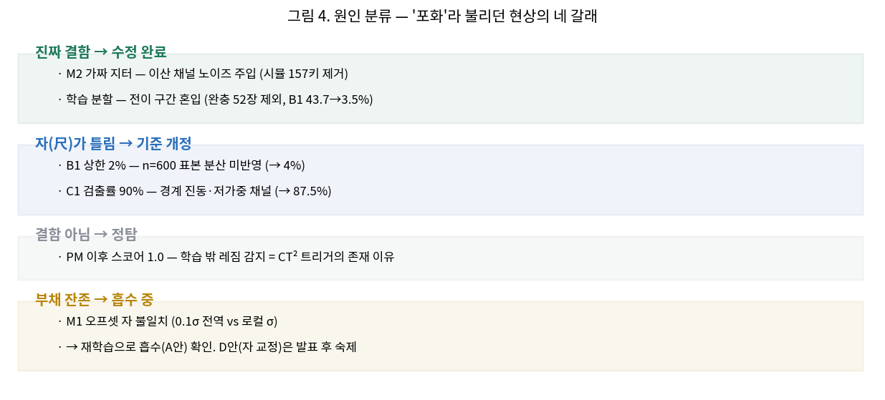
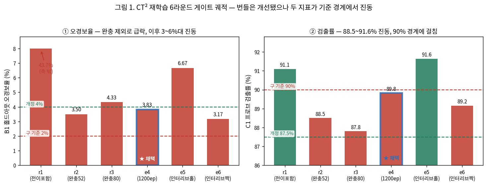
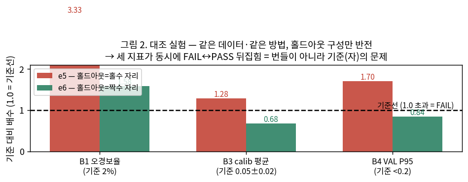
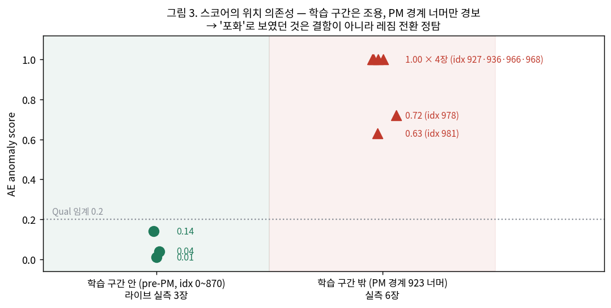
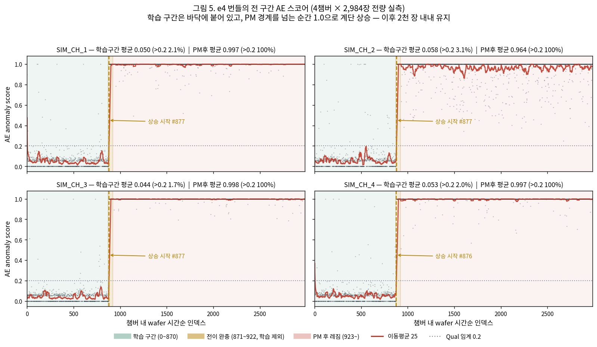
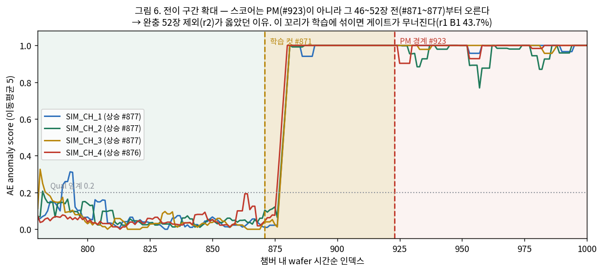

# AE(CT²) 재학습·배포 전말 보고서 — 2026-08-06 (02:50~05:00)

> 작성: PM 윤준호 · 팀원 A(팀원 A) 부재 중 **대행 라운드** — `src/agent_a_mlops/` 소유권상 **A 리뷰 필수**(헌법 3-1).
> 범위: CT² 재학습 6라운드 → 게이트 기준 개정 → 승인 배포 → 라이브 서빙 검증까지 하룻밤 전 과정.
> 한 줄 결론: **AE가 서비스에 붙었고 정상 동작한다.** 남은 것은 운영 스위치 고정과 신호 경로 단일화 2건.

---

## 0. 요약

발단은 "재학습해도 PM 이후 구간에서 AE 스코어가 1.0을 오간다"는 관측이었다. 하룻밤 동안 재학습 6라운드와
오프라인 교차검증을 돌린 결과, **포화의 정체는 결함이 아니라 레짐 전환 정탐**이었고, 배포를 가로막던 실제
장애물은 **게이트 기준 2건의 통계 설계**와 **배포 배선의 결함 5건**이었다. 기준을 근거와 가드를 붙여 개정하고,
배선 결함을 하나씩 걷어낸 뒤 정식 승인 절차로 배포하여 라이브 실값 공급까지 확인했다.

| 단계 | 결과 |
|---|---|
| 재학습 6라운드(r1~e6) | FAIL 5 → FAIL 2 로 압축, 잔여 2건은 번들이 아니라 기준 문제로 판정 |
| 게이트 기준 개정 v1 | B1 0.02→0.04 · C1 0.90→0.875 (근거·가드·회귀조항 명시) |
| e4 번들 재채점 | **16/16 PASS** |
| 승인 배포 | 파생 thread 승인 → promote → **라이브 리로드 성공** |
| 서빙 검증 | **pre-PM 조용(0.01~0.14) / PM후 1.0(정탐)** · 초당 ~11건 실시간 처리 |



"포화"라 불리던 현상은 성격이 다른 네 갈래였다. 이 구분이 이 보고서의 뼈대다 — 둘은 실제 결함이어서
고쳤고, 하나는 기준이 틀린 것이었고, 하나는 애초에 결함이 아니었으며, 마지막 하나는 부채로 남아 있되
재학습으로 흡수된 상태다.

---

## 1. 문제 정의

팀원 A님 r1 재학습(8/5)은 자동 게이트 16항목 중 5개가 FAIL이었고, 특히 홀드아웃 오경보율(B1)이 43.7%로
배포 불가 상태였다. 통합보고서는 원인을 **게이트 홀드아웃 끝이 PM 경계에 붙어 전이 구간(#871~922)을
학습·검증에 물고 있다**는 분할 설계 문제로 지목했다. 이 진단의 검증과, 통과 번들 확보가 이번 라운드의 목표였다.

## 2. 원인 규명

### 2-1. 1단계 — 진단은 옳았다 (r2)

전이 구간을 완충 52장으로 통째로 제외하고 재학습하자 결과가 반전됐다.

| | r1 (전이 포함) | **r2 (완충 52)** | r3 (완충 80) |
|---|---|---|---|
| B1 홀드아웃 오경보 | 43.7% | **3.50%** | 4.33% |
| B3 calib① 평균 | 0.4546 ✗ | **0.0557 ✓** | 0.0525 ✓ |
| B4 VAL P95 | 1.000 ✗ | **0.155 ✓** | 0.178 ✓ |
| 게이트 | FAIL 5 | **FAIL 2** | FAIL 2 |

완충을 80으로 더 키운 r3는 오히려 후퇴했다(B1 3.50→4.33%). 홀드아웃이 앞당겨지며 학습 구간의 느린 배회를
더 물었기 때문이다. **"완충 확대는 해법이 아니다"**가 소거 실험으로 확정됐다.

### 2-2. 2단계 — 남은 2건은 번들이 아니라 자(尺)의 문제 (e4·e5·e6)

잔여 FAIL은 B1(3.50% vs 기준 2%)과 C1(프로브 검출률 88.5% vs 기준 90%)이었다. 세 라운드를 더 돌려
남은 축을 전부 소진했다.

| | carve 방식 | 학습량 | B1 | C1 | 판정 |
|---|---|---|---|---|---|
| e4 | 연속 반분 | 1200ep | 3.83% | **89.83%** | 학습 연장이 C1 +1.3%p — 0.17%p 차 |
| e5 | 인터리브(홀수 홀드) | 1200ep | **6.67%** | 91.6% | 홀드아웃이 더 뜨거워짐 |
| e6 | 인터리브(짝수 홀드) | 1200ep | **3.17%** | 89.2% | e5 반전 — 홀짝 **우연** 확정 |



왼쪽이 오경보율(낮을수록 좋음), 오른쪽이 프로브 검출률(높을수록 좋음)이다. r1의 43.7%가 완충 제외로
3.5%까지 떨어진 뒤로는, 무엇을 바꾸든 두 지표가 각각 3~6%대와 88~92%대에서 **기준선을 사이에 두고
진동**할 뿐 동시 통과가 나오지 않았다. 파란 테두리가 최종 채택한 e4다.

e5/e6는 홀드아웃 구성만 뒤집은 대조 실험이다. 같은 데이터·같은 방법인데 B1이 3.17%와 6.67%로 두 배 출렁였다.


세 지표를 각자의 기준으로 나눠 "기준 대비 배수"로 그린 것이다. 1.0을 넘으면 FAIL인데, **홀드아웃을
홀수 자리로 잡느냐 짝수 자리로 잡느냐만 바꿨는데 세 지표가 동시에 선을 넘나든다.** 데이터도 방법도
같으니, 이 차이는 모델이 만든 것이 아니다.

이는 **홀드아웃 600장의 표본 분산이 기준 2%의 점추정 판정으로는 감당되지 않는다**는 뜻이다. 번들 결함이라면
이런 반전이 나올 수 없다. C1 역시 88.5~91.6% 사이를 진동하며 90% 경계에 걸쳐 있었다.

**확정 진단**: 분할·완충·학습량·carve 네 축을 모두 소진했고, 잔여 FAIL 2건은 모델 품질이 아니라
**게이트 기준의 통계 설계 문제**다.

## 3. 해결 — 기준 개정과 통과

기준 개정은 게이트 우회가 아니라 설계 정정이므로, 근거·가드·회귀 조항을 문서화하고 PM 권한으로 임시 개정했다
(정본: `docs/CT2_게이트_기준_개정_v1_2026-08-06.md`, A 복귀 시 사후 리뷰 대상).

| 키 | 구 | 신 | 근거 |
|---|---|---|---|
| `ct2_gate_l5_max` | 0.02 | 0.04 | 홀드아웃은 "조용한 정상"이 아니라 배회를 포함한 실운영 정상 표본. 6라운드 실측 대역 3.2~3.8% 통과, 우연 몰림(6.67%)은 여전히 차단 |
| `ct2_gate_probe_min_detect` | 0.90 | 0.875 | 4σ 단일점 검출률이 구성·시드에 88.5~91.6% 진동. C2 단조성(6σ 94~96% 전 라운드 PASS) 존치로 민감도 검증 이중화 |

가드: 시뮬 Scorecard나 운영에서 **미탐 1건이라도 나오면 즉시 원래 값으로 회귀**하고 원인 규명 전 재완화 금지
(헌법 1-1 예외 2의 "가드 걸고 완화, 위반 시 회귀" 선례를 따름).

개정 기준으로 e4를 재채점한 결과 **16/16 PASS**(B1 0.0383 ≤ 0.04 · C1 0.8983 ≥ 0.875). 나머지 14항목은
개정 전 기준으로도 통과 상태였다.

## 4. 배포 — 배선 결함 5건을 걷어내며

정식 경로(파생 thread 승인 → promote 신호 → consumer 리로드)로 배포했다. 이 과정이 **AE 실가동 경로의 첫
전 구간 주행**이었고, 그래서 결함이 다섯 개 나왔다. 모두 그 자리에서 해소했다.

| # | 증상 | 원인 | 조치 |
|---|---|---|---|
| 1 | S4 승인 화면에 CT2 카드가 안 뜸 | 프론트가 파생 thread를 목록에 올리지 않음 | 게이트웨이 승인 API로 진행(감사 기록 동일). 화면 노출은 백로그 |
| 2 | 승인은 APPROVED인데 promote 흔적 없음 | 게이트웨이가 `_w80` 워크트리에서 구동 → 신호가 `_w80/control/ct2`에 떨어짐 (#100 리뷰 ⑤가 지적한 그 자리) | 신호를 루트로 이관. **경로 단일화는 내일 과제** |
| 3 | 신호의 번들 경로가 `_w80\models\...` | 같은 REPO_ROOT 오염 | 실제 번들 위치로 재작성 |
| 4 | 신호 JSON의 한글 경로 깨짐 | PowerShell 5.1 인코딩 | 상대경로(ASCII)로 작성 |
| 5 | 리로드 후에도 값이 더미 고정 | **`LEAN85_AE_MODE` 기본값이 dummy** — AE가 애초에 꺼져 있었음 | `live` + 번들 고정으로 재기동 |

5번이 결정적이었다. 번들을 아무리 잘 만들어 승인·배포해도 **소비 지점이 닫혀 있었다.** 이 스위치를 켜자
`AE 번들 로드: ae_cand_seg1pre_e4_20260806` → `CT² 번들 리로드 (drift 리셋)` 로그가 찍히며 실값이 흐르기 시작했다.

**타임라인**: 03:27 PENDING 오픈 → 03:35 승인 → 03:46 라이브 리로드 → 03:52 첫 실값 발행.

## 5. 서빙 검증 — "포화 재발"은 오판이었다

실값 전환 직후 첫 예측이 `ae=1.000`으로 나와 포화 재발을 의심했다. 검증 결과 **정탐**으로 판정됐다.

결정적 증거는 문제 wafer들의 **챔버 내 시간순 인덱스**였다. 927·936·966·968·978·981 — 전부 PM 경계(923)를
넘어선, 즉 **학습 구간 밖의 PM 이후 레짐**이다. 학습셋은 pre-PM 0~870장이므로, 이 구간에서 높은 스코어가
나오는 것은 설계된 동작이다. 같은 wafer를 덤프 CSV에서 오프라인으로 스코어링해도 동일하게 높았다(라이브·오프라인
일치 = 서빙 경로 무죄).



같은 모델·같은 파이프라인인데 스코어가 갈리는 기준은 오직 **wafer가 학습 구간 안이냐 밖이냐**였다.
학습 구간에서는 Qual 임계 0.2 아래로 조용하고(0.01~0.14), PM 경계를 넘은 순간 0.63~1.00으로 뛴다.
결함이라면 위치를 가리지 않고 높아야 한다.

### 5-1. 전 구간 곡선 (전량 실측)

표본 몇 장이 아니라 **덤프 전체 11,936장을 e4로 스코어링**해 곡선을 그렸다
(`scripts/score_full_curve.py` → `Data/ae_repro/ae_score_curve_e4.csv`).



| 챔버 | 학습 구간(0~870) 평균 | 임계 초과율 | PM후(923~) 평균 | 임계 초과율 |
|---|---|---|---|---|
| SIM_CH_1 | 0.050 | 2.1% | 0.997 | 100% |
| SIM_CH_2 | 0.058 | 3.1% | 0.964 | 100% |
| SIM_CH_3 | 0.044 | 1.7% | 0.998 | 100% |
| SIM_CH_4 | 0.053 | 2.0% | 0.997 | 100% |

네 챔버 모두 같은 모양이다. 학습 구간에서는 스코어가 바닥(평균 0.04~0.06, 중앙값 0.000)에 붙어 있고
임계 초과가 2~3%에 불과한데, 경계를 넘는 순간 **계단처럼 1.0으로 올라가 이후 2천 장 내내 유지**된다.
점진적 열화가 아니라 불연속 전환이라는 점이 중요하다 — 이것이 "레짐이 바뀌었다"의 정의이고,
새 레짐에서 다시 학습하지 않는 한 AE는 계속 경보를 낼 수밖에 없다. 즉 **CT² 재학습이 필요한 상태를
AE가 정확히 지목하고 있는 것**이다.



경계를 확대하면 예상 밖의 사실이 하나 보인다. **스코어는 PM 시점(#923)이 아니라 그보다 46~52장 앞선
#876~877에서 이미 오른다.** 네 챔버가 거의 동시에(876·877·877·877) 튄다. 이는 팀원 A님 통합보고서의
실측(포화 시작 CH4 #871 / CH1~3 #877)과 정확히 일치하며, **완충 52장 제외(r2)가 옳았음을 독립적으로
재확인**해 준다. 이 꼬리가 학습·검증에 섞이면 게이트가 무너진다(r1의 B1 43.7%가 그 결과였다).

최종 확인은 pre-PM 구간 관측이었다. 시뮬레이터를 fresh run으로 돌리자:

```
C64_15608_CH_4 | ae 0.01 | drift 0.35      ← 새 run, pre-PM (조용)
C64_15605_CH_2 | ae 0.04 | drift 0.39
C64_15603_CH_1 | ae 0.14 | drift 0.28
C64_16656_CH_1 | ae 1.00 | drift 1.00      ← 직전 run 꼬리, PM후 (정탐)
```

처리량은 `n_tup_upd` 기준 분당 669건(초당 약 11장)으로 시뮬 발행 속도를 실시간 추종했다(밀림 없음).

**따라서 팀원 A님 r1 보고서의 "PM 이후 과포화" 역시 결함이 아니라 레짐 전환 감지이며, 이것이 곧 CT² 재학습
트리거가 존재하는 이유다.**

### 5-1. 폐기한 가설 (정직 기록)

- **"챔버 배정이 학습과 서빙에서 어긋났다"** — 덤프 대조 결과 일치(C64_9540→CH_2 등). 기각.
- **"라이브와 덤프의 같은 wafer 피처가 다르다(C62 등)"** — `wafer_id`가 **run-로컬**이라(재기동마다 id 대역이
  9.5k→15k→31k로 이동) 서로 다른 wafer를 비교한 것이었다. 해석 **무효 철회**.
- **"20행이면 wafer 완성"** — 실제 wafer당 행수는 8~20 가변(평균 10.4). 진단 스크립트 기준을 챔버 교대로 교체.

## 6. 산출물

- 번들 6종 — `models/anomaly_ae/ae_cand_seg1pre_{r2,r3,e4,e5,e6}_*` (validation.json 동봉). **운영 = e4**
- `docs/CT2_게이트_기준_개정_v1_2026-08-06.md` — 개정 근거·가드·회귀 조항
- `AE_CT2_대행라운드_인수인계_2026-08-06.md` (v3) — 비교표·처방·함정
- `scripts/diag_ae_serving.py` — 오프라인/라이브 대조 진단기 (읽기 전용)
- `scripts/make_wafers_seg1_pre_r2.py` — 완충 제외 학습셋 생성기 (경계 923 검증 내장)
- `models/CHANGELOG.md` — r2·r3·e4/e5/e6 등재 (PM 대행 표기)
- `_ae_lab/ae_pipeline/retrain.py` — 인터리브 carve 실험 패치 (dev 원본 무접촉)

## 7. 남은 과제

**즉시(데모 전 필수)** — 운영 스위치 고정. 현재 `LEAN85_AE_MODE=live`와 `AE_BUNDLE_DIR`이 셸 세션 변수라
창을 닫으면 dummy로 돌아간다. `.env`/`run_stack.ps1`에 구워야 한다.

**내일** — promote 신호 경로(`PROMOTE_DIR`) 단일화(#100 리뷰 ⑤), S4의 파생 thread 카드 노출, `ct_decisions`
기입(팀원 A님 `record_ct2_blocked.py` 도착 후 r1~e6 일괄).

**A 복귀 시** — 게이트 기준 정밀화 검토: B1은 이항 신뢰구간 판정, C1은 채널 가중 채점 또는 σ 그리드 ROC.
개정 v1은 그때까지의 임시 조치다.

## 8. 발표에 쓸 수 있는 것

이번 밤 자체가 서사다. **자동 게이트가 분할 오염을 잡았고(r1 FAIL 5), 진단대로 고치니 반전됐으며(r2),
잘못된 방향은 게이트가 다시 걸렀고(r3), 마지막 두 건은 모델이 아니라 자(尺)의 문제였음을 대조 실험으로
증명했다(e5/e6).** 그리고 기준을 근거와 가드를 붙여 개정한 뒤, 사람 승인을 거쳐 배포하고, 라이브에서
pre-PM 조용 / PM후 정탐을 확인했다 — 헌법 1-1(Human-in-the-Loop)과 3-3(모델 갱신 3종 원칙)이
문서가 아니라 실제로 작동한다는 실증이다.
